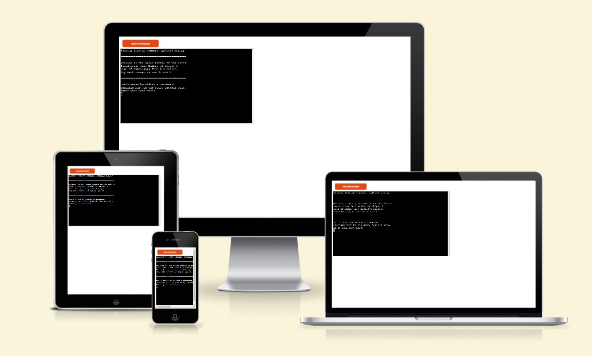
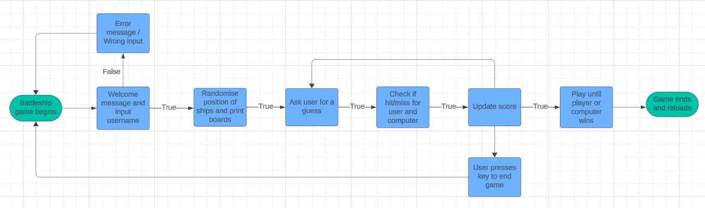
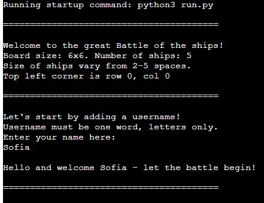
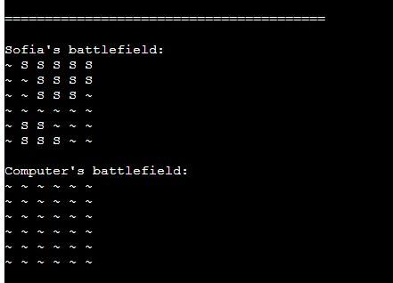
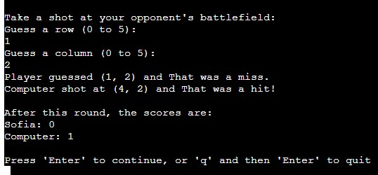
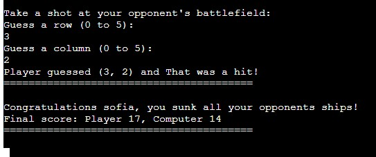
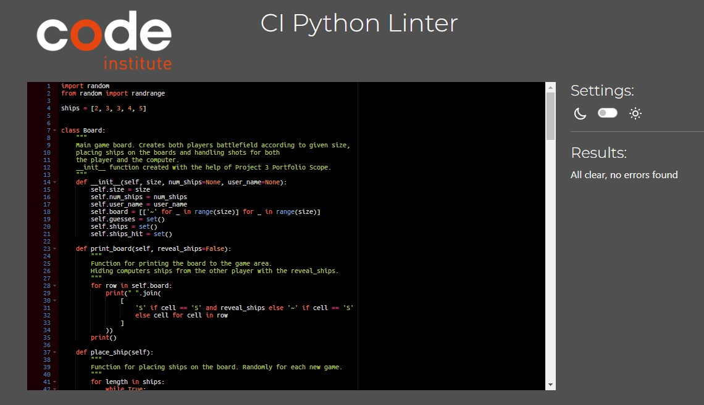

# The great battle of the ships!
This game is based on the classic Battleship game, this time created using Python and runs in the Code Institute mock terminal on Heroku.

The players goal is to find and sink all of the opponents battleships before they find theirs. The opponent in this case is the computer. 

[Here is the live version of the game.](https://battle-of-the-ships-bf10998e45dd.herokuapp.com/)

## How to play

The game begins with a short introduction containing the games conditions regarding board size, number of ships and lenght of the ships. 

The player then enters a username and two game boards are generated at random.

The player can only see the ships on their own board, marked with an "S". The computers ships remain hidden. 

There are five ships of various sizes that the player needs to locate in order to win. 

The player will then be asked to guess on the location of the opponents ships via cooordinates on the board, and gets a response in form of a hit or miss.

Hits are marked on the board with an "*", miss with a "X".

The player and the computer take turn in guessing the location of the opponents ships until one of them finds and sinks them all. 

## Features

### Flow chart

Before starting with the code for the project I made a simple Flowchart using [Lucidchart](https://www.lucidchart.com/pages/?) to collect my thoughts and draw a simple picture of what features and problems I needed solutions to. 

### Existing features

* Direct input from "the game" when the user starts, providing some useful information and conditions for playing the game.

* After that the user is asked for input in the form of a username that will appear throughout the game.
A return message in the form of "Oops, not a valid username. Please enter your name again."appears until the player provide us with a valid username - which in this case is one word, letters only. If the user inputs a number, a symbol or more than one word the program will continue to ask for a valid one.

* After a correct username is provided a welcome message is returned to the player. The program then print two boards to the game area, paired with a function to randomly place ships on both players boards.

* There is also a function for hiding the Computers ships on the board from the other player.

* At each new turn the player is asked to input coordinates in a given a row and a column from the provided board size - if the player makes the same guess twice they get a returning message asking for a new guess, until they provide new coordinates. 

* After the player has made their guess the computer gets a shot which is made randomly, but checks if the coordinates have been hit before and in that case randomly chose another spot to shot at. 

* A function to check after each shot if its a hit or miss, and return a respone to the player.

* A score tracking system that adds a point to the players when they hit the opponents ship.

* After each round the player gets a response about the current score, and are then aksed to either "Press 'Enter' to continue, or 'q' and then 'Enter' to quit!". If they choose to quit they get a "Thanks for playing!" 

* The game continues until one player sinks all the opponents ships. There is a function to check after each round if either the player or the computer has reached the total number of ship cells given in order to win - and if the player wins they get at printed message with a congratulations along with the final score. If the player loose they get a "Better luck next time" along with the final score.

### Features left to implement

* The possibility for the player to position their own ships would be a nice feature, just like when you play the game in real life.

* The option to choose your own board size and the number of ships woud also be a fun feature.  

* A little congrats-response after each sunk ship.

## Data model eg class

For this project i used the class "Board" for my main functions. I had two classes at one point to keep the features apart, but that only made the programming more complex since the functions I'm using all work together it proved easier to keep most of them in the same class. 

The Board class contains the board size, the number of ships, functions for positioning the ships, validation of the ships placement on the board, functions to handle both players shots and checking for a winner after each round. 

The class also holds methods such as print, if-else statements, while-loops and return-messages to move the game forward. 

## Testing

I manually tested the program by doing the following:
* Gave invalid input on every place possible - letters instead of numbers, guesses outside of the board size, provided the same guess twice and so on.

* Continuosly tested the run.py in my local terminal and then on the Code Institute Heroku mock terminal.

## Validator testing

I ran the PEP8 Python Validator a few times throughout the coding process and fixed the errors as they occured, so that I would not have an enormous list to fix in the end.
* No errors were returned from [PEP8 Python Validator](https://pep8ci.herokuapp.com/) in the finished project.

## Bugs 

* There were a LOT of error messages regarding references to functions, arguments, methods and indentations throughout the coding, and Google became my saviour at this point. I've gone through a minimum of 50 error messages while running my program in the local terminal - some of them are visible in my commits, some aren't. But thanks to all the amazing problem solvers in different forums (mentioned in the Credit-section), I was hopefully able solve them all. print-meassge also did their thing in the debugging process.

* Some of the biggest issues I had to solve were issues with the score counting, which in the end turned out to be because of some whitespace causing trouble. The score also started counting from 1 instead of 0 for some time. 

* The most hair loss was caused by the functions to give the player a new guess when they had already guessed for those coordinaties, in the end there was an issue with the calling of the handle_shot function that I managed to solve.

* At the last manual testings in my local terminal I noticed that the program didn't always print out 17 ships on my board, so I had to change valid_ship_position function since it didn't validate ships positioned outside the board size.

* When the project was deployed to Heroku a new problem appeard - when the game was supposed to end no winner or loser-message appeard, the game just continued to ask for input even though the player had reached the total number of ship cells on the board. So a new debugging session began with printing-messages to track the score count and actions throughout the game process. It came down to a single break-statement that had been wrongfully indented - which I pretty much solved by accident ... but its nice to have luck on your side sometimes. 

* I had some problems with GitPod not running as it should in the local terminal in the beginnig of the project - so to start with there were some copy + paste from working with the project in [replit](https://replit.com/) as well, but that solved itself after a while luckily. 

### Unsolved bugs

* When you make invalid guesses at coordinates you can't break out of the loop in the game until you provide correct ones, but in my mind you're not interesed in it at that point. But I think that would be a feature I would like to add in the future. 

* In the option to press "Enter" to continue playing, or "q" and then "Enter" to quit - the player can actually press any buttons to continue playing if they wish, but the game won't continue until they hit "Enter". 

## Deployment

This project was deployed using Code Institutes mock terminal for Heroku.

Steps for deployment in Heroku:
* Create a new app in Heroku
* Under "Settings" add "Create Var" containing the key PORT and the value 8000.
* Further down (still under the "Settings"-tab), add Buildpacks "Python" and "Node.js" - in that order. 
* Under the "Deploy"-tab choose Deployment method GitHub and connect to the right repository. 
* Manually deploy the project via main-branch.

The link to the mock terminal in Heroku can be found here: [https://battle-of-the-ships-bf10998e45dd.herokuapp.com/](https://battle-of-the-ships-bf10998e45dd.herokuapp.com/)

## Credits

### Content

* The use of the "try and except" command, used for some invalid input, I mainly learned from the Love Sandwiches code along, as well as some wisdom on how to structure the code.

* For the init-function at the top of the code I took some help from the [Project Portfolio Scope Video](https://learn.codeinstitute.net/courses/course-v1:CodeInstitute+PE_PAGPPF+2021_Q2/courseware/b3378fc1159e43e3b70916fdefdfae51/605f34e006594dc4ae19f5e60ec75e2e/), along with the logic around using the Board-class.

* Some help with the Python built-in functions I got from the [Python library](https://docs.python.org/3/library/functions.html).

* Watching this [Youtube Tutorial](https://www.youtube.com/watch?v=alJH_c9t4zw) by Knowledge Mavens about creating an object oriented Battleship game helped me to simplify my code. It also helped me with understanding what functions I needed to provide in order for the game to run. 

* As mentioned above, I hit the different forums for solutions to my problems. As usual Stack Overflow provided me with some good answers, [this page](https://stackoverflow.com/questions/77575338/battleship-project-with-python) in particular helped me alot. 

